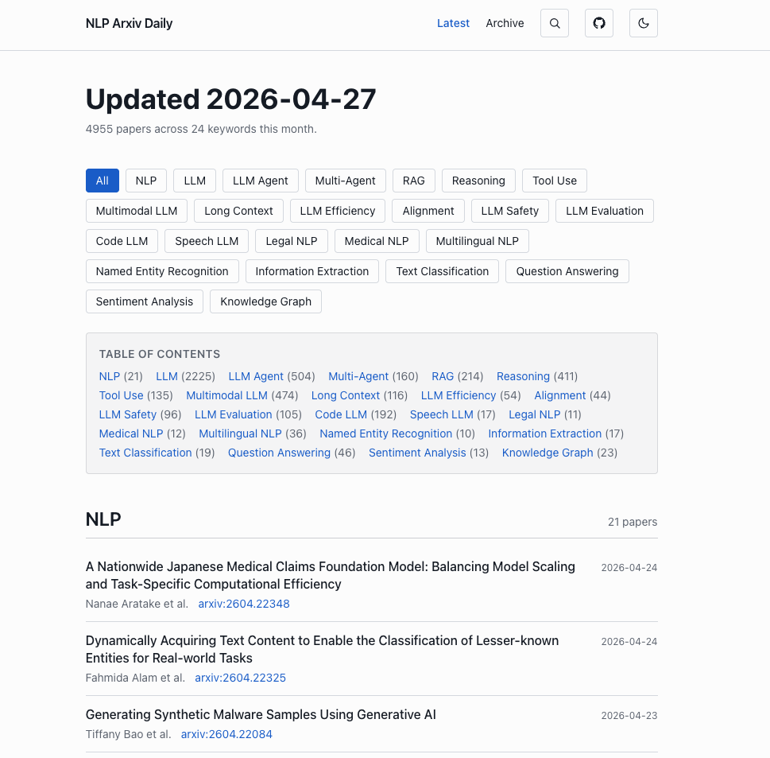

<div align="center">

# 📚 NLP Arxiv Daily

**Automatically tracked NLP & LLM papers from arXiv — updated every 12 hours.**

[](https://monologg.kr/nlp-arxiv-daily)
[](https://monologg.kr/nlp-arxiv-daily/rss.xml)
[](https://github.com/monologg/nlp-arxiv-daily/actions/workflows/nlp-arxiv-daily.yml)
[](https://github.com/monologg/nlp-arxiv-daily/actions/workflows/astro-build.yml)

### 👉 [**Browse papers on the website →**](https://monologg.kr/nlp-arxiv-daily)

<a href="https://monologg.kr/nlp-arxiv-daily">
  
</a>

</div>

---

## Features

- 🔎 **Full-text search** across every paper (powered by [Pagefind](https://pagefind.app))
- 🏷️ **Keyword tabs** — NLP, LLM, RAG, Reasoning, Multimodal, Long Context, Code LLM, …
- 🗓️ **Monthly archives** going back to launch
- 📡 **[RSS feed](https://monologg.kr/nlp-arxiv-daily/rss.xml)** for your reader of choice
- 🌓 Light/dark theme, mobile-friendly, no tracking

## How it works

```
arXiv API ──► fetcher ──► JSON snapshots ──► Astro static site ──► GitHub Pages
                              │
                              └──► docs/nlp-arxiv-daily-web.json + docs/archive-web/*.json
```

A GitHub Actions cron runs every 12 hours: it queries arXiv per keyword, merges results into the monthly JSON archives, then triggers an Astro rebuild and deploy.

Code lives in `nlp_arxiv_daily/` (Python pipeline) and `web/` (Astro site).

## 🍴 Fork & make it yours

Want a daily tracker for *your* keywords (vision, RecSys, robotics, your own niche)? Fork this repo and edit one file.

### 1. Fork the repo

Click **Fork** on GitHub.

### 2. Edit `config.yaml`

Set your GitHub username/repo and replace the `keywords` block with whatever you want to track:

```yaml
user_name: "your-github-username"
repo_name: "your-fork-name"

max_results: 10            # papers per keyword per fetch
publish_gitpage: True      # keep True so the website still builds

keywords:
  "Recommender Systems":
    filters: ["Recommender System", "Sequential Recommendation", "Collaborative Filtering"]

  "Graph Neural Networks":
    filters: ["Graph Neural Network", "GNN", "Graph Transformer"]

  "Diffusion":
    filters: ["Diffusion Model", "Score-Based Generative", "DDPM"]
```

Each `filters` entry is an arXiv search query — phrases are quoted and OR'd together. Section order on the site follows the order in this file.

> 💡 **Tip:** start with 5–8 keywords. Too many filters means heavy arXiv traffic and slower runs.

### 3. Update site identity

- `web/public/CNAME` — your custom domain, or delete this file to use `https://<user>.github.io/<repo>`
- `web/astro.config.mjs` — set `site` and `base` to match your deploy URL
- `web/src/layouts/Layout.astro` — adjust the page title/description

### 4. Enable Actions & Pages

- **Settings → Actions → General**: allow read/write permissions for workflows
- **Settings → Pages**: source = "GitHub Actions"
- Run the **Run Arxiv Papers Daily** workflow once manually to seed the JSON, then push to trigger the Astro build

### 5. (Optional) Backfill historical months

```bash
uv run python -m nlp_arxiv_daily backfill --start 2024-01 --end 2025-12
```

Idempotent — safe to re-run.

## Local development

Requires Python 3.13+ and Node 22+. The repo uses [`uv`](https://docs.astral.sh/uv/) and [`pnpm`](https://pnpm.io/).

```bash
# pipeline
make set-dev
uv run python -m nlp_arxiv_daily run        # fetch + persist JSON
uv run python -m nlp_arxiv_daily fetch      # fetch only
make test                                   # run unit tests
make quality                                # ruff lint + format

# website
cd web
pnpm install
pnpm dev                                    # localhost:4321
pnpm build && pnpm preview
```

## Reference

This project is a fork-in-spirit of **[Vincentqyw/cv-arxiv-daily](https://github.com/Vincentqyw/cv-arxiv-daily)** — the original "arxiv-daily" pattern for computer vision. Huge thanks to that repo for the idea and the original `config.yaml`/keyword-filter design.

What's different here:
- NLP/LLM keyword set instead of CV
- JSON-first pipeline (no giant markdown tables in the repo)
- Astro static site with Pagefind search, RSS, OG images
- Monthly archives split into separate JSON files for fast incremental rebuilds
