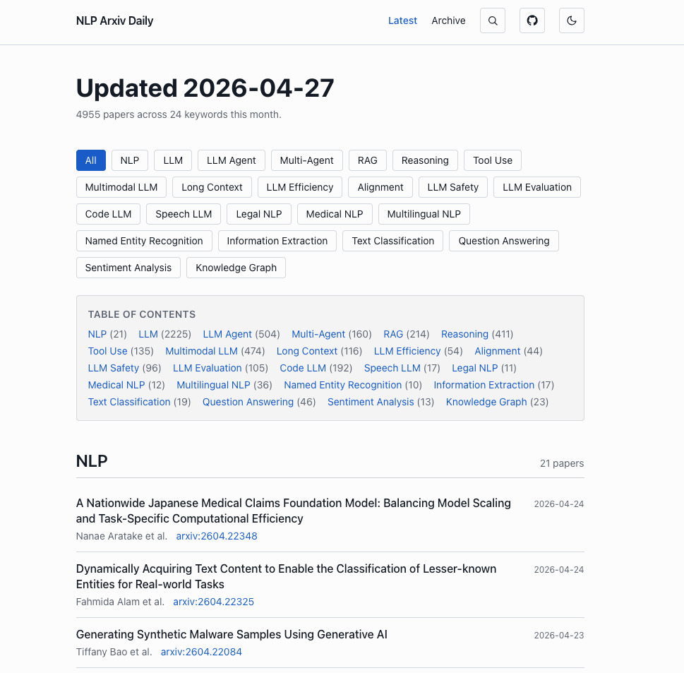

<div align="center">

# 📚 NLP Arxiv Daily

**Automatically tracked NLP & LLM papers from arXiv — updated every 12 hours.**

[](https://monologg.kr/nlp-arxiv-daily)
[](https://monologg.kr/nlp-arxiv-daily/rss.xml)

[](https://github.com/monologg/nlp-arxiv-daily/actions/workflows/nlp-arxiv-daily.yml)
[](https://github.com/monologg/nlp-arxiv-daily/actions/workflows/astro-build.yml)

### 👉 [**Browse papers on the website →**](https://monologg.kr/nlp-arxiv-daily)

<a href="https://monologg.kr/nlp-arxiv-daily">
  
</a>

</div>

---

## Features

- 🔎 **Full-text search** across every paper (powered by [Pagefind](https://pagefind.app))
- 🏷️ **Keyword tabs** — NLP, LLM, RAG, Reasoning, Multimodal, Long Context, Code LLM, …
- 🗓️ **Monthly archives** going back to launch — one page per keyword and month, 200 papers a page, like arXiv's own listings
- 📡 **[RSS feed](https://monologg.kr/nlp-arxiv-daily/rss.xml)** for your reader of choice — plus one feed per keyword (e.g. [`/rss/rag.xml`](https://monologg.kr/nlp-arxiv-daily/rss/rag.xml), `/rss/llm-agent.xml`)
- 📥 **BibTeX export** — per paper (copy button), per keyword, or the whole page / month as one `.bib` file (e.g. [`/bibtex/all.bib`](https://monologg.kr/nlp-arxiv-daily/bibtex/all.bib), `/bibtex/rag.bib`, `/archive/2026-08/all.bib`)
- 🗂️ **Zotero-ready** — every list page embeds [COinS](https://en.wikipedia.org/wiki/COinS) metadata, so the Zotero connector can save all papers on a page in one click (as Preprint items with DOI, URL, and the keyword as a tag)
- 🌓 Light/dark theme, mobile-friendly, no tracking

## How it works

```
arXiv API ──► fetcher ──► JSON snapshots ──► Astro static site ──► GitHub Pages
                              │
                              └──► docs/nlp-arxiv-daily-web.json + docs/archive-web/*.json
```

A GitHub Actions cron runs every 12 hours: for each keyword it fetches every submission from the last 7 days (idempotent merge, so re-sightings are free), stores the results in the monthly JSON archives, then triggers an Astro rebuild and deploy.

Each JSON file is `{keyword: {arxiv_id: paper}}`, where `paper` is a record like:

```json
{
  "date": "2026-09-07",
  "title": "…",
  "authors": ["Ada Lovelace", "Alan Turing"],
  "url": "http://arxiv.org/abs/2609.05339v1",
  "code": "https://github.com/x/y",
  "categories": ["cs.CL", "cs.IR"]
}
```

Papers fetched before September 2026 are stored as a one-line markdown string instead (title, first author, date, links only); the site renders both. Abstracts are fetched but not stored — they were most of the file size and the site doesn't show them. The JSON files are stable and safe to consume directly if you want the data without the website.

Code lives in `nlp_arxiv_daily/` (Python pipeline) and `web/` (Astro site).

## 🍴 Fork & make it yours

Want a daily tracker for *your* keywords (vision, RecSys, robotics, your own niche)? Fork this repo and edit one file.

### 1. Fork the repo

Click **Fork** on GitHub.

### 2. Edit `config.yaml`

Set your GitHub username/repo and replace the `keywords` block with whatever you want to track:

```yaml
user_name: "your-github-username"
repo_name: "your-fork-name"

daily_lookback_days: 7     # each run re-scans the last N days per keyword
max_results: 1500          # safety cap per keyword per run (not a target)
publish_gitpage: True      # keep True so the website still builds

keywords:
  "Recommender Systems":
    filters: ["Recommender System", "Sequential Recommendation", "Collaborative Filtering"]

  "Graph Neural Networks":
    filters: ["Graph Neural Network", "GNN", "Graph Transformer"]

  "Diffusion":
    filters: ["Diffusion Model", "Score-Based Generative", "DDPM"]
```

Each `filters` entry is an arXiv search query — phrases are quoted and OR'd together. Section order on the site follows the order in this file.

> 💡 **Tip:** start with 5–8 keywords. Too many filters means heavy arXiv traffic and slower runs.

### 3. Update site identity

- `web/public/CNAME` — your custom domain, or delete this file to use `https://<user>.github.io/<repo>`
- `web/astro.config.mjs` — set `site` and `base` to match your deploy URL
- `web/src/layouts/Layout.astro` — adjust the page title/description

### 4. Enable Actions & Pages

- **Settings → Actions → General**: allow read/write permissions for workflows
- **Settings → Pages**: source = "GitHub Actions"
- Run the **Run Arxiv Papers Daily** workflow once manually to seed the JSON, then push to trigger the Astro build

### 5. (Optional) Backfill historical months

```bash
uv run python -m nlp_arxiv_daily backfill --start 2024-01 --end 2025-12 --delay-seconds 15
```

**Keywords are not era-neutral.** The LLM-era tags (`LLM Agent`, `LLM Efficiency`,
`Code LLM`, …) were added in 2026-04 to follow post-ChatGPT work, and their
filters are ordinary words elsewhere: `Autonomous Agent` and `AI Agent` are
1990s multi-agent-systems vocabulary, `Quantization` is signal processing,
`LoRA` is a radio protocol, `Code Generation` is a compiler term. Backfilling
them into the pre-2022 years fills the archive with unrelated papers — a 2016
`LLM Agent` query returned work on kinetic wealth distribution and DNS
tunneling. History before 2022-10 is therefore covered by the era-neutral NLP
keywords only (`NLP`, `Question Answering`, `Knowledge Graph`,
`Text Classification`, `Information Extraction`, `Named Entity Recognition`,
`Sentiment Analysis`, `Multilingual NLP`, `Medical NLP`, `Legal NLP`); the
LLM-era tags start where the keyword did.

Idempotent — safe to re-run. Run it in chunks (`--keywords "A,B,C"`, a few months at a time): arXiv rate-limits aggressively. `--delay-seconds` applies between every request, and 15s is what keeps a long run 429-free; 10s earned a 429 (and a ~40 minute IP throttle) about an hour in. A keyword with more than 2,000 papers a month hits arXiv's per-query result cap; add `--window-days 7` to query the month in weekly windows, and watch the log for `cap hit` if a window still overflows.

### 6. (Optional) Repair code links after a throttled run

A HuggingFace Papers lookup that fails is stored as `code: null`, which is
indistinguishable from "this paper has no repo" — and the paper then counts as
known, so no later fetch re-asks. Feed the run's log back in to repair them:

```bash
uv run python -m nlp_arxiv_daily recheck-code-links --from-log run.log --dry-run
uv run python -m nlp_arxiv_daily recheck-code-links --from-log run.log
```

It scrapes `HF Papers lookup failed for <id>` lines (or takes `--ids a,b,c`),
re-asks HuggingFace, and fills in only the rows still missing a link.

### 7. (Optional) Serve AdSense ads

The layout injects the AdSense script only when `PUBLIC_ADSENSE_CLIENT` is set at build time. Add a repository variable (**Settings → Secrets and variables → Actions → Variables**) named `ADSENSE_CLIENT` with your publisher ID (e.g. `ca-pub-XXXXXXXXXXXXXXXX`) — the build workflow passes it through. Without it the site builds ad-free.

## Local development

Requires Python 3.13+ and Node 22+. The repo uses [`uv`](https://docs.astral.sh/uv/) and [`pnpm`](https://pnpm.io/).

```bash
# pipeline
make set-dev
uv run python -m nlp_arxiv_daily run        # fetch + persist JSON
uv run python -m nlp_arxiv_daily fetch      # fetch only
make test                                   # run unit tests
make test-integration                       # real arXiv/HF smoke (not run in PR CI)
make quality                                # ruff lint + format

# website
cd web
pnpm install
pnpm dev                                    # localhost:4321
pnpm build && pnpm preview
```

## Reference

This project is a fork-in-spirit of **[Vincentqyw/cv-arxiv-daily](https://github.com/Vincentqyw/cv-arxiv-daily)** — the original "arxiv-daily" pattern for computer vision. Huge thanks to that repo for the idea and the original `config.yaml`/keyword-filter design.

What's different here:
- NLP/LLM keyword set instead of CV
- JSON-first pipeline (no giant markdown tables in the repo)
- Astro static site with Pagefind search, RSS, OG images
- Monthly archives split into separate JSON files for fast incremental rebuilds
